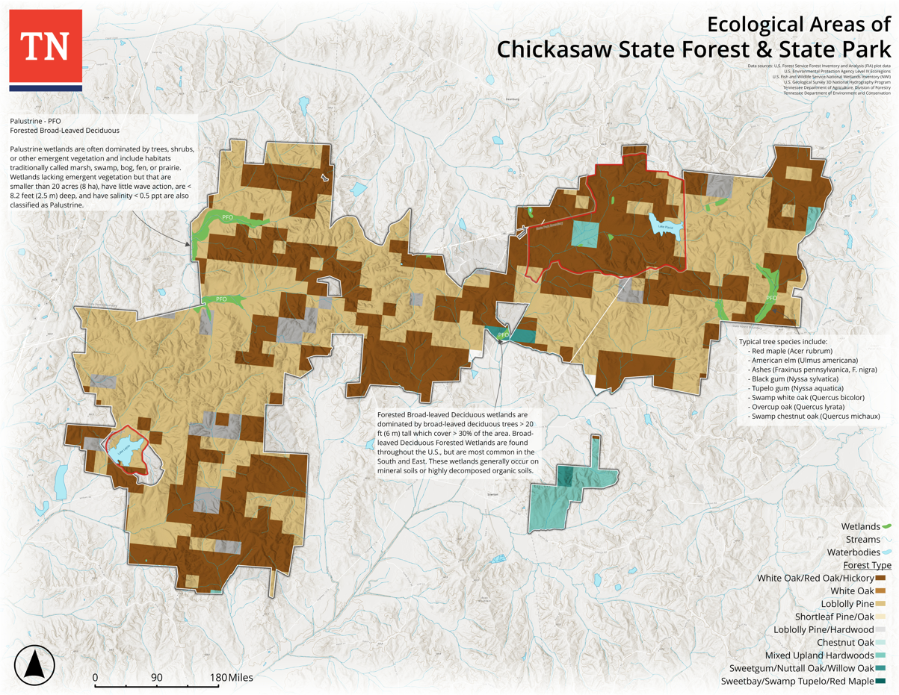

<p align="center">
  
</p>

<p align="center">
  <a href="https://github.com/colinstiles" target="_blank" rel="noopener noreferrer">
    
  </a>
  <a href="https://www.tn.gov/agriculture.html" target="_blank" rel="noopener noreferrer">
    
  </a>
  <a href="https://www.google.com/maps/place/Chattanooga,+TN" target="_blank" rel="noopener noreferrer">
    
  </a>
</p>

<p align="center">
  
</p>

## Hello, I'm Colin

I'm a **GIS Manager and Data Scientist** building spatial data systems for the **Tennessee Department of Agriculture, Division of Forestry**.

I turn forest, field, and operational data into maps, workflows, and decision-making tools that help public-sector teams understand what is happening on the ground and act with confidence.

I live in Chattanooga, Tennessee. Outside of GIS and forestry, I love whitewater kayaking, climbing, scuba diving, and gravel biking.

## What I build

- Spatial analysis workflows for forestry operations, planning, and reporting.
- Clean, reproducible data pipelines that turn raw field data into usable products.
- Maps and dashboards designed for real decisions, not just visual polish.
- Automation that saves staff time and reduces manual data cleanup.

## Things I Care About

```text
geospatial analysis        forest data systems        public-sector technology
data science workflows     practical automation       clear, useful outputs
```

## Featured Work

<p align="center">
  
</p>

## Connect

<p>
  <a href="https://colinstiles.github.io/cts-gis-portfolio/" target="_blank" rel="noopener noreferrer"></a>
  <a href="https://www.linkedin.com/in/colin-t-stiles-gisp-386717292/" target="_blank" rel="noopener noreferrer"></a>
